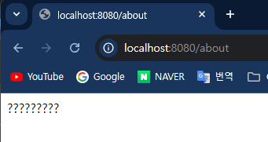

## Springboot 리뷰

### DAY 01
> 1. 웹 페이지 만들기(Controller)
> 2. 상품목록 페이지 만들기(Thymeleaf)
> 3. MySQL DB 호스팅 받기
> 4. DB 연동 및 JPA 세팅
> 5. JPA 로 테이블(Entity)만들기
> 6. DB 데이터 출력
---
## 웹 페이지 만들기(Controller)
> Springboot 에서 웹페이지를 만들기 위해서는 Controller 클래스를 만들어야 한다.

### Controller&RestController
- `Springboot` 는 어노테이션 기반으로 동작한다.
- `@Controller` 와 `@RestController` 가 있는데 차이점은 다음과 같다.
  - `@Controller` : **HTML 과 같은 View** 를 클라이언트(브라우저)에게 전달한다.
  - `@RestController` : **Json 데이터나 문자열**같은 데이털르 클라이언트에게 전달한다. 주로 API 통신에 이용
- 하지만 @Controller 를 클래스에 선언해두고 내부에서 문자열을 전송하고 싶으면 메서드에 `@ResponseBody` 어노테이션을 붙혀준다. 
### Controller 예시
- 클래스단에서 `@Controller` 를 생성하고 클래스 내부에 메서드단에서는 URL 매핑이되는 메서드를 생성해준다.
  ```java
  @GetMapping("/")
  //    @ResponseBody // 문자열을 전송
  public String index(){
      return "index.html";
  }
  ```
- 그리고 `index.html` 문서는 `/resources/static` 내부에 작성하면 컨트롤러에서 `파일명.html` 만 적어주면 알아서 찾아가서 랜더링하게 된다.
  ```html
  <!doctype html>
  <html lang="ko">
  <head>
    <meta charset="UTF-8">
    <meta name="viewport" content="width=device-width, user-scalable=no, initial-scale=1.0, maximum-scale=1.0, minimum-scale=1.0">
    <meta http-equiv="X-UA-Compatible" content="ie=edge">
    <title>Index</title>
  </head>
  <body>
    <h1>Index HTML 입니다 ㅋㅋ</h1>
  </body>
  </html>
  ```
- `Springboot` 를 실행하고 `localhost:8080/` 에 접속하면 방금 입력한 `index.html` 이 화면에 랜더링된다.
  
  

### RestController 예시
- `@RestController` 어노테이션을 클래스 단에 생성해도 되지만 `@Controller` 어노테이션을 클래스에 붙히고 HTML 전송이 아닌 메서드에만 `@ResponseBody` 만 붙혀줘도 된다.
  - 주로 API 통신만 하는 클래스에 `@RestController` 를 붙혀주는게 좋다.
  ```java
  @GetMapping("/about")
  @ResponseBody
  public String about(){
      return "?????????";
  }
  ```
  
---
## 상품목록 페이지 만들기(Thymeleaf)
> HTML 문서는 정적인 문서이다. 보통 화면에서 동적인 기능을 구현할려면 JS 를 사용하지만 서버단에서 랜더링할려면 템플릿 엔진을 사용해서 구현해야 한다.

### Thymeleaf 란?
- 템플릿 엔진 중 하나로 **Spring 에서 강력하게 밀어주는 템플릿 엔진**이다.
- 예전에는 JSP 를 사용하였지만 _성능이나 속도면에서 Thymeleaf 가 더 우수하고 코드가 HTML 을 많이 망가뜨리지 않기때문에 JSP 를 추천하지 않는다._
- `Thymeleaf` 를 사용하기 위해서는 `build.gradle` 에서 의존성을 추가해주고 HTML 문서 상단에 `<html lang="ko" xmlns:th="http://www.thymeleaf.org">` 적어주면 된다.
- 그리고 `THymeleaf` 문서의 위치는 `/resources/templates` 안에 넣어준다.
- 또 `Controller` 에서는 파일명만 적어주면 알아서 뷰리졸버가 찾아간다.
- 서버에서 데이터를 가져올 때는 아래와 같이 문법을 사용한다.
  ```html
  <!doctype html>
  <html lang="ko" xmlns:th="http://www.thymeleaf.org">
  <head>
    <meta charset="UTF-8">
    <meta name="viewport" content="width=device-width, user-scalable=no, initial-scale=1.0, maximum-scale=1.0, minimum-scale=1.0">
    <meta http-equiv="X-UA-Compatible" content="ie=edge">
    <title>Shop List</title>
  </head>
  <body>
    <div>
      
      <h4 th:text="${name}">바지</h4>
      <p>7억</p>
    </div>
    <div>
      
      <h4>셔츠</h4>
      <p>8억</p>
    </div>
  </body>
  </html>
  ```
- 그리고 `Controller` 에서는 `Model` 객체를 이용하여 `Thymeleaf` 로 데이터를 던진다.
  ```java
  @Controller
  public class ItemController {
  
      @GetMapping("/list")
      String list(Model model){
          model.addAttribute("name","박지성");
          return "list";
      }
  }
  ```
  
---
## MySQL DB 호스팅 받기
> DB를 사용하는 방법은 로컬에 DB를 설치하여 연동하거나, 클라우드 서비스에서 DB를 호스팅 받거나 둘 중 하나이다.

### 1. Azure Database 호스팅 설정.
- MS사의 [Azure](https://azure.microsoft.com/) 사이트에 들어가서 MS 계정으로 로그인 후 카드등록을 한 후 
1. [Microsoft Azure](https://portal.azure.com/#home) 페이지 이동
2. 검색창에 `Azure Database for MySQL 유동 서버` 검색
3. 만들기 -> 유연한 서버 만들기 클릭
4. 프로젝트 세부 정보 칸은 요금정보가 저장되는 곳 리소스 그룹의 새로만들기를 클릭 후 임의로 작명하자.
5. 서버 정보 칸은 다음과 같다.
   - **서버 이름** : DB 서버의 이름을 기입
   - **지역** : Korea Central 선택
   - **MySQL 버전** : 8.0 선택
   - **워크로드 유형** : 개발 또는 취미 프로젝트용 선택
   - **컴퓨팅 + 스토리지** : 가장 낮은 것을 선택, 그리고 서버 구성 클릭 후  IOPS 는 '미리 프로비전된 IOPS'를 선택하고 저장 클릭
6. 인증 칸에서는 관리자 사용자 이름과 암호를 적어서 따로 적어두자.
7. 하단에 다음 클릭하여 네트워크 부분에 모든 IP를 추가해주자.(배포 시에는 고정 IP만 적어줘야함)
8. 완료를 누르면 몇분 후 DB가 생성된다.
9. 배포가 완료된 DB를 들어가서 좌측에 설정->서버 매개 변수 클릭
   - 검색창에 `require_secure_transport` 검색후 값을 OFF로 설정
   - 이유는 개발연습용이기 때문에 SSL 인증같은 부가작업을 끄는 설정이다.
10. 저장 

### 2. IDE 에서 DB 연결하기
> 인텔리제이 유료버전에서는 우측에 Database 클릭 후 추가해주면 된다.

- `Host` : Azure 사이트에 배포된 DB클릭 후 서버이름에 적힌 값을 적어준다.
- `username` : DB 생성시 적었던 username
- `password` : 위와 동일
---
## DB 연동 및 JPA 세팅
> DB연동을 위해서는 DB 드라이버와 ORM 기술을 의존성 추가해줘야 한다.

### 의존성 추가
- `build.gradle` 파일에서 JPA 와 MySQL 드라이버를 추가해주자.
  `runtimeOnly 'com.mysql:mysql-connector-j'`
  `implementation 'org.springframework.boot:spring-boot-starter-data-jpa'`
- 그리고 `application.properties`(또는 yml)에 DB접속 정보와 JPA 세팅을 간단하게 해준다.
  ```properties
  spring.application.name=shop
  
  # DB
  spring.datasource.url=jdbc:mysql://jaeyoungmysql.mysql.database.azure.com/shop
  spring.datasource.username=DB접속아이디
  spring.datasource.password=DB접속비번
  spring.datasource.driver-class-name=com.mysql.cj.jdbc.Driver
  
  # JAP
  spring.jpa.properties.hibernate.show_sql=true
  spring.jpa.hibernate.ddl-auto=create
  spring.jpa.properties.hibernate.dialect= org.hibernate.dialect.MySQLDialect
  ```

### 중요정보 암호화하기
- 프로젝트를 만들다 보면 **DB접속 정보**이외에도 **API 키** 같은 여러 민감한 정보들이 있다.
- 이 때는 `application` 파일을 분리하여 관리하고 _Github 에 push 할 때는 중요정보가 있는 파일은 빼는게 좋다._
- `application-secrets.properties` 파일 안에는 DB접속 정보인 `username` 과 `password`를 추가해주고 `application.properties` 에는 다음과 같이 작성한다.
  ```properties
  spring.application.name=shop
  
  # DB
  spring.datasource.url=jdbc:mysql://jaeyoungmysql.mysql.database.azure.com/shop
  spring.profiles.include=secrets
  spring.datasource.driver-class-name=com.mysql.cj.jdbc.Driver
  
  # JAP
  spring.jpa.properties.hibernate.show_sql=true
  spring.jpa.hibernate.ddl-auto=create
  spring.jpa.properties.hibernate.dialect= org.hibernate.dialect.MySQLDialect
  ```
---
## JPA 로 테이블(Entity)만들기
> JPA 같은 ORM 기술이 있다면 테이블 생성 시 직접 생성 쿼리를 작성하지 않고 클래스를 생성하면서 객체지향적으로 테이블을 생성할 수 있다.

### 클래스작성
- 우선 엔티티를 더 편리하게 생성할려면 `Lombok` 라이브러리가 필요하다
  - `build.gradle` 에 `Lombok` 을 추가해주자.
- 우선 클래스를 DB 테이블과 매핑시킬려면 클래스위에 `@Entity` 를 사용해줘야 한다.
- 그리고 각 **필드들이 테이블 컬럼으로 생성**이 되는데 PK가 되는 필드에는 `@Id` 와 `@GeneratedValue(strategy = GenerationType.IDENTITY)` 를 추가해준다.
  - `strategy` 에는 여러 값이 들어가지만 필요할 떄 찾아서 넣으면 된다.
- 그리고 그 외에 컬럼들은 **null 허용**이나 **길이** 등등 추가 속성을 줄 수 있다.
  - 참고로 `@Getter` , `@Setter` 는 getter/setter 를 자동생성해주는 어노테이션이다.
  - `@NoArgsConstructor` 는 기본생성자를 만들어준다.
  ```java
  @Getter @Setter
  @NoArgsConstructor
  @Entity
  public class Item {
      @Id @GeneratedValue(strategy = GenerationType.IDENTITY)
      private Long id;
  
      // String 은 255자만 넣을수 있지만 긴 문자열을 넣을 수 있따.
  //    @Column(nullable = false, columnDefinition = "TEXT")
      @Column(nullable = false, length = 1000)
      private String title;
  
      @Column(nullable = false)
      private Integer price;
  }
  ```
### 테이블 확인
- `Springboot` 를 실행하면 클래스 설계에 따라 자동으로 DB 테이블에 생성이 된다.
  - 단, `application.properties` 에서 `ddl-auto` 를 `create` 로 해야 처음 실행 시 생성이 된다.

  
---
## DB 데이터 출력
> 보통은 `Repository` 에서 직접 DB를 건들여서 `Service` 에서 데이터 가공 및 처리 후 `Controller` 에서 사용자에게 보내준다.<br>
> 이번예제에서는 `Service` 를 생략한다.

### Repository 생성 및 주입
- 우선 `class` 가 아닌 `interface` 파일을 생성한다.
- 그리고 `JpaRepository<T,V>` 를 상속받는다.
  - `T` 는 **반환 엔티티** 타입, `V` 는 **주식별자** 타입이다.
  - JPA가 아닌 JDBC 나 다른 라이브러리를 사용한다면 방법은 달라진다.
- 그리고 `@Repository` 어노테이션을 클래스단에 적어줘야 하지만 **JPA는 생략해도 알아서 스프링 컨테이너에 등록**이 된다.
  ```java
  public interface ItemRepository extends JpaRepository<Item, Long> {
  
  }
  ```
- 주입은 여러 주입 방법이 있지만 생성자 주입을 사용한다.
- `Lombok` 이 있으면 `@RequiredArgsConstructor` 어노테이션으로 생성자 코드를 생략할 수 있다. 단, **필드에 final** 을 붙혀줘야 한다.
- 그리고 주입받은 필드를 통해 JPA 에서 제공해주는 메서드를 사용하여 데이터를 불러와서 View로 전달할 수 있다.
  ```java
  @RequiredArgsConstructor
  @Controller
  public class ItemController {
  
      private final ItemRepository itemRepository;
  
      @GetMapping("/list")
      String list(Model model){
          model.addAttribute("items", itemRepository.findAll());
          return "list";
      }
  }
  ```
- 데이터가 궁금하다면 위 코드를 수정하고 콘솔창을 확인해보자
  ```java
  @RequiredArgsConstructor
  @Controller
  public class ItemController {
  
      private final ItemRepository itemRepository;
  
      @GetMapping("/list")
      String list(Model model){
          List<Item> items = itemRepository.findAll();
          for (Item item : items) {
              System.out.println("item = " + item);
          }
          model.addAttribute("items", items);
          return "list";
      }
  }
  ```
  

### Thymeleaf 데이터 출력
- `Controller` 에서 `model` 을 이용해 DB데이터를 View 로 전달하는것까지 완료했다.
- 이제 `Thymeleaf` 에서 코드를 추가하여 받은 데이터를 출력한다.
- 전달받은 **데이터는 List 기 때문에 Thymeleaf 에서 반복문**을 통하여 각 데이터를 뽑아준다.
  ```html
  <!doctype html>
  <html lang="ko" xmlns:th="http://www.thymeleaf.org">
  <head>
    <meta charset="UTF-8">
    <meta name="viewport" content="width=device-width, user-scalable=no, initial-scale=1.0, maximum-scale=1.0, minimum-scale=1.0">
    <meta http-equiv="X-UA-Compatible" content="ie=edge">
    <title>Shop List</title>
    <link href="/css/main.css" rel="stylesheet">
  </head>
  <body>
  <div class="card" th:each="item: ${items}">
    
    <div>
      <h4 th:text="${item.getTitle()}">바지</h4>
      <p th:text="${item.getPrice()}">7억</p>
    </div>
  </div>
  
  </body>
  </html>
  ```
  
---