## Springboot 리뷰

### DAY 02
> 1. 상품 데이터 추가
> 2. 상품 상세페이지
> 3. REST API 의 예외처리
> 4. Service 레이어 분리
> 5. 상품 데이터 수정하기
> 6. 상품 데이터 삭제하기
---
## 상품 데이터 추가
### 1. 상품 입력 폼 생성
- `form` 태그에 `input` 태그를 통해 사용자에게 입력을 받고 `button` 태그로 서버에 전송한다.
- 이 때 `input` 태그의 **name 값이 서버로 전달될 때 key 값**이 된다.
  ```html
  <!doctype html>
  <html lang="ko" xmlns:th="http://www.thymeleaf.org">
  <head>
    <meta charset="UTF-8">
    <meta name="viewport" content="width=device-width, user-scalable=no, initial-scale=1.0, maximum-scale=1.0, minimum-scale=1.0">
    <meta http-equiv="X-UA-Compatible" content="ie=edge">
    <title>Shop add</title>
    <link href="/css/main.css" rel="stylesheet">
  </head>
  <body>
  <form action="/write" mehtod="post">
    <input name="title">
    <input name="price">
    <button type="submit">전송</button>
  </form>
  
  </body>
  </html>
  ```
  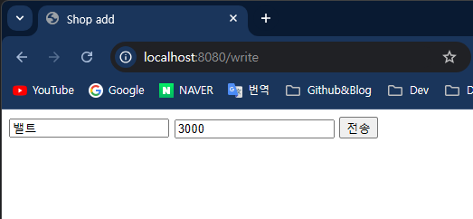
### 2. controller 생성
- 단순히 `form` 을 `return` 만 해주면 되기 때문에 `GetMapping` 으로 작성한다.
  ```java
  @GetMapping("/write")
  public String write(){
      return "write";
  }
  ```
- 그리고 `form` 에서 전송버튼 클릭 시 데이터를 받는 `PosteMapping` 을 생성한다.
- 보통 데이터가 넘어올 때 타입이 `x-www-form-urlencoded` 인데 이 유형의 데이터를 컨트롤러에서 받을 때는 `@RequestParam` 으로 받는다.
- 그리고 데이터를 저장할 때는 **Item 인스턴스를 만들어서 넘어온 데이터로 필드를 채우고 save()를 호출하여 DB에 저장**한다.
- 그리고 보통 데이터를 저장하면 `redirect` 로 상세화면으로 넘어간다.
  ```java
  @PostMapping("/add")
  public String add(@RequestParam String title, @RequestParam Integer price) {
      System.out.println("title = " + title);
      System.out.println("price = " + price);
      Item item = new Item();
      if (title.length() > 0 && !title.isBlank() && !title.isEmpty() && price > 0) {
          item.setTitle(title);
          item.setPrice(price);
          itemRepository.save(item);
      }
      return "redirect:/list";
  }
  ```
  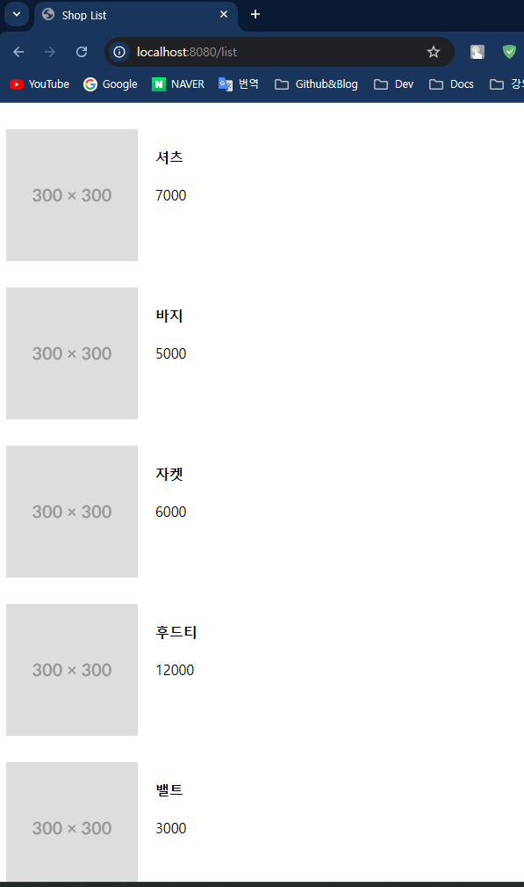
### 3. @ModelAttribute
- 컨트롤러에서 받는데이터가 2개라면 문제없지만 수십개의 값을 받는다면 파라미터를 수십개 적어야하고, 만약 **API 스펙이 바뀌어서 필드가 추가된다면 HTML 도 수정하고 Controller 도 수정**해야 한다.
- 이 때, 전달받은 데이터로 이루어진 객체를 만들어 객체로 받을 수 있다.
  ```java
  @PostMapping("/add")
  public String add(@ModelAttribute Item item) {
      System.out.println("item.getTitle() = " + item.getTitle());
      System.out.println("item.getPrice() = " + item.getPrice());
  
      if(item!=null)
          itemRepository.save(item);
      return "redirect:/list";
  }
  ```
### 4. HTML 코드 재사용(Thymeleaf)
- navbar 코드는 다음과 같다.
  ```html
  <div class="nav">
    <a class="logo">SpringMall</a>
    <a>List</a>
    <a>Write</a>
  </div>
  ```
- 위 UI 를 list 페이지만 아니라 `write` 페이지에서도 쓰기위해서 Thymeleaf 문법을 통해 재사용한다.
- `resources/templates` 경로에 `nav.html` 이라는 파일을 만들고 아래와 같이 navbar 코드를 수정한다.
  ```html
  <div class="nav" th:fragment="navbar">
    <a class="logo">SpringMall</a>
    <a>List</a>
    <a>Write</a>
  </div>
  ```
- 그리고 위 UI 코드를 사용하고 싶은 파일에서 다음과 같이 작성한다.
  ```html
  <div th:replace="~{nav.html::navbar}"></div>
  ```
  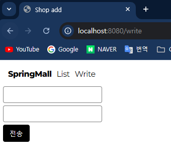
---
## 상품 상세페이지
> 상품 상세페이지의 URL 을 설계할 때는 `REST API` 설계를 바탕으로 한다. 즉, **리소스를 식별**할 수 있게 설계한다.

### 1. Controller 생성
- 우선 상세페이지기 때문에 `detail` 이라는 변수와 각 상품의 id값을 이용하여 URL 을 `/detail/{id}` 로 설계한다.
- `{id}` 는 **쿼리파라미터(쿼리스트링)**으로 인식이 되어 컨트롤러에서 `@PathVariable` 을 통해 **동적인 id값**을 받아올 수 있다.
- 그리고 `JPARepository` 가 제공하는 `findById()`를 통해 엔티티를 가져오는데 이 때 `Optional` 로 반환된다.
  - `Optional` 이란 Java8부터 도입된 클래스로 실제 엔티티를 `Optional<>` 로 감싸져있고,  `NullPointerException` 을 방지해주는 좋은 클래스이다.
  - `isPresent()` 로 `Null` 을 판단하고 `get()` 을 통해 실제 엔티티를 가져온다.
  ```java
  @GetMapping("/detail/{id}")
  public String detail(@PathVariable Long id, Model model) {
      Optional<Item> findItem = itemRepository.findById(id);
      if (!findItem.isPresent()) {
          throw new EntityNotFoundException("엔티티를 찾을 수 없습니다!");
      }
      model.addAttribute("item", findItem.get());
      return "detail";
  }
  ```
### 2. Form 생성
- 컨트롤러에서 받은 item 이라는 key로 동적인 데이터를 랜더링한다.
  ```html
  <!doctype html>
  <html lang="ko" xmlns:th="http://www.thymeleaf.org">
  <head>
    <meta charset="UTF-8">
    <meta name="viewport" content="width=device-width, user-scalable=no, initial-scale=1.0, maximum-scale=1.0, minimum-scale=1.0">
    <meta http-equiv="X-UA-Compatible" content="ie=edge">
    <title>Shop Detail</title>
    <link href="/css/main.css" rel="stylesheet">
  </head>
  <body>
  <div th:replace="~{nav.html::navbar}"></div>
  <div class="detail">
    <h4>상세페이지</h4>
    
    <h4 th:text="${item.getTitle()}">금도금 바지</h4>
    <p th:text="${item.getPrice()()}">7억</p>
  </div>
  
  </body>
  </html>
  ```
- 그리고 list 페이지에서도 상품 클릭시 해당상품 상세페이지로 이동할 수 있게 수정해준다.
  ```html
  <!doctype html>
  <html lang="ko" xmlns:th="http://www.thymeleaf.org">
  <head>
    <meta charset="UTF-8">
    <meta name="viewport" content="width=device-width, user-scalable=no, initial-scale=1.0, maximum-scale=1.0, minimum-scale=1.0">
    <meta http-equiv="X-UA-Compatible" content="ie=edge">
    <title>Shop List</title>
    <link href="/css/main.css" rel="stylesheet">
  </head>
  <body>
  <div th:replace="~{nav.html::navbar}"></div>
  
  <div class="card" th:each="item: ${items}">
    <a th:href="@{|/detail/${item.getId()}|}">
      
      <div>
        <h4 th:text="${item.getTitle()}">바지</h4>
        <p th:text="${item.getPrice()}">7억</p>
      </div>
    </a>
  </div>
  
  </body>
  </html>
  ```
  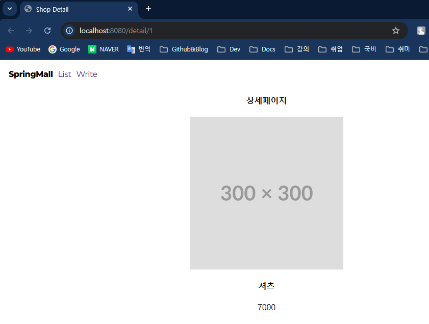
---
## REST API 의 예외처리
> REST API 가 아닌 시스템에서는 템플릿엔진에서 제공하는 에러페이지등을 활용하여 예외처리를 할 수 있다. REST API 의 경우에는 Spring에서 제공해주는 다양한 예외처리 방법을 쓰면 된다.

### 1. try-catch
- 기본적인 `try-catch` 문으로 예외처리를 구현한다.
  ```java
  @GetMapping("/detail/{id}")
  public String detail(@PathVariable String id, Model model) {
      try {
          Optional<Item> findItem = itemRepository.findById(Long.parseLong(id));
          if (!findItem.isPresent()) {
              throw new EntityNotFoundException("엔티티를 찾을 수 없습니다!");
          }
          model.addAttribute("item", findItem.get());
          return "detail";
      } catch (Exception e) {
          System.out.println(e.getMessage());
          return "redirect:/list";
      }
  }
  ```
- 반환값을 `HTTP 상태코드`를 반환하면 클라이언트에서 작업하는 프론트엔드 개발자는 에러를 명확히 알 수 있다.
- 이 때 사용하는 것이 `ResponseEntity` 이다.
  ```java
  @GetMapping("/detail/{id}")
  public ResponseEntity<?> detail(@PathVariable String id, Model model) {
      try {
          Optional<Item> findItem = itemRepository.findById(Long.parseLong(id));
          if (!findItem.isPresent()) {
              throw new EntityNotFoundException("엔티티를 찾을 수 없습니다!");
          }
          model.addAttribute("item", findItem.get());
          return ResponseEntity.status(HttpStatus.OK).body("성공임");
      } catch (Exception e) {
          System.out.println(e.getMessage());
          return ResponseEntity.status(HttpStatus.BAD_REQUEST).body("클라이언트 오류임");
      }
  }
  ```
### 2. @ExceptionHandler
- 위 `try-catch` 문은 예외가 날 것같은 부분에 `try-catch` 절로 묶거나 특정 예외에 따른 예외처리 방법을 각각 코드에 기입해야 한다.
- 만약 예외처리 해야 하는 코드가 점점 길어지면 코드 가독성도 떨어지고 코드길이가 길어지게 된다.
- `Spring` 에서 제공하는 `@ExceptionHandler` 를 사용하면 같은 클래스 내부에서 일어나는 에러를 공통으로 처리할 수 있다.
  ```java
  @ExceptionHandler(Exception.class)
  public ResponseEntity<?> handler(){
      // 같은 클래스 내부에서 에러가 난다면 해당 메서드가 에러를 잡아서 처리한다.
      return ResponseEntity.status(HttpStatus.BAD_REQUEST).body("공통에러 처리하겠음.");
  }
  ```
### 3. @ControllerAdvice
- 같은 클래스 내부가 아닌 프로젝트 전체에서 일어나는 에러를 글로벌하게 처리할려면 `@ControllerAdvice` 어노테이션이 붙은 클래스에서 처리하면 된다.
  ```java
  @ControllerAdvice
  public class MyExceptionHandler {
      @ExceptionHandler(Exception.class)
      public ResponseEntity<?> handler(){
          // 같은 클래스 내부에서 에러가 난다면 해당 메서드가 에러를 잡아서 처리한다.
          return ResponseEntity.status(HttpStatus.BAD_REQUEST).body("공통에러 처리하겠음.");
      }
  }
  ```
- 위 코드는 `Exception` 으로 모든 예외를 잡지만 특정 예외를 처리할려면 해당 예외에 맞는 예외타입은 `@ExceptionHandler()`에 적어주면 된다.
---
## Service 레이어 분리
> 하나의 클래스는 하나의 기능만 구현해야한다. 하지만 Controller 레이어에 메서드에 add() 메서드를 보면 데이터 유효성검사와 DB저장, HTML 반환같이 3가지 기능을 하고있다.
> 보통 Controller 는 HTML 반환을 주로하기 때문에 그 외의 비즈니스 로직은 Service 레이어에서 처리한다.

### 1. Service 코드 생성
- `Service` 레이어를 생성할 때는 클래스위에 `@Service` 를 붙혀준다.
- 그리고 DB 저장같이 DB데이터가 변하는 작업들은 메서드 위에 `@Transactional` 을 붙혀준다.
  ```java
  @RequiredArgsConstructor
  @Service
  public class ItemService {
      private final ItemRepository itemRepository;
      
      @Transactional
      public void saveItem(String title, Integer price){
          Item item = new Item();
          if (title.length() > 0 && !title.isBlank() && !title.isEmpty() && price > 0) {
              item.setTitle(title);
              item.setPrice(price);
              itemRepository.save(item);
          }
      }
  }
  ```
### 2. Controller 코드 수정
- `Controller` 에서는 `Service` 객체를 주입받고 메서드를 호출하여 클라이언트로부터 받은 데이터만 `Service` 레이어로 넘겨주면 된다.
  ```java
  @PostMapping("/add")
  public String add(@RequestParam String title, @RequestParam Integer price) {
      itemService.saveItem(title, price);
      return "redirect:/list";
  }
  ```
- 위 코드처럼 기존의 `Controller` 레이어의 비즈니스 로직은 `Service` 레이어로 분리하면 다음과 같이 변경된다.
  ```java
  @RequiredArgsConstructor
  @Controller
  public class ItemController {
      private final ItemService itemService;
  
      @GetMapping("/list")
      public String list(Model model) {
          model.addAttribute("items", itemService.findAllItem());
          return "list";
      }
  
      @GetMapping("/write")
      public String write() {
          return "write";
      }
  
      @PostMapping("/add")
      public String add(@RequestParam String title, @RequestParam Integer price) {
          itemService.saveItem(title, price);
          return "redirect:/list";
      }
  
      @GetMapping("/detail/{id}")
      public String detail(@PathVariable String id, Model model) {
          try {
              model.addAttribute("item",itemService.findItem(id));
              return "detail";
          } catch (Exception e) {
              System.out.println(e.getMessage());
              return "redirect:/list";
          }
      }
  }
  ```
  ```java
  @RequiredArgsConstructor
  @Service
  public class ItemService {
      private final ItemRepository itemRepository;
  
      @Transactional
      public void saveItem(String title, Integer price){
          Item item = new Item();
          if (title.length() > 0 && !title.isBlank() && !title.isEmpty() && price > 0) {
              item.setTitle(title);
              item.setPrice(price);
              itemRepository.save(item);
          }
      }
  
      public Item findItem(String id) {
          Optional<Item> findItem = itemRepository.findById(Long.parseLong(id));
          if (!findItem.isPresent()) {
              throw new EntityNotFoundException("엔티티를 찾을 수 없습니다!");
          }
  
          return findItem.get();
      }
  
      public List<Item> findAllItem() {
          return itemRepository.findAll();
      }
  }
  ```
---
## 상품 데이터 수정하기
> 서비스마다 다르겠지만 보통 수정은 상세페이지에서 수정버튼을 생성하여 수정폼에서 구현한다. 하지만 여러 상품이 있는 목록페이지에 각 버튼을 추가하여 수정해도 된다.

### 1. 상품 상세페이지에 수정버튼 추가
- `list.html` 페이지에 다음과 같이 수정한다.
- 타임리프 문법으로 가져온 동적인 ID값을 `onclick` 함수에 파라미터로 넣을려면 `onclick` 도 타임리프 문법에 맞게 사용해야 한다.
  ```html
  <!-- 생략 ... -->
  <div th:replace="~{nav.html::navbar}"></div>
  <div class="card" th:each="item: ${items}">
    <a th:href="@{|/detail/${item.getId()}|}">
      
    </a>
      <div>
        <div>
          <h4 th:text="${item.getTitle()}">바지</h4>
          <p th:text="${item.getPrice()}">7억</p>
        </div>
        <button class="btn-update" th:onclick="|updateForm(${item.getId()})|">수정</button>
      </div>
  </div>
  <!-- 생략 ... -->
  ```
  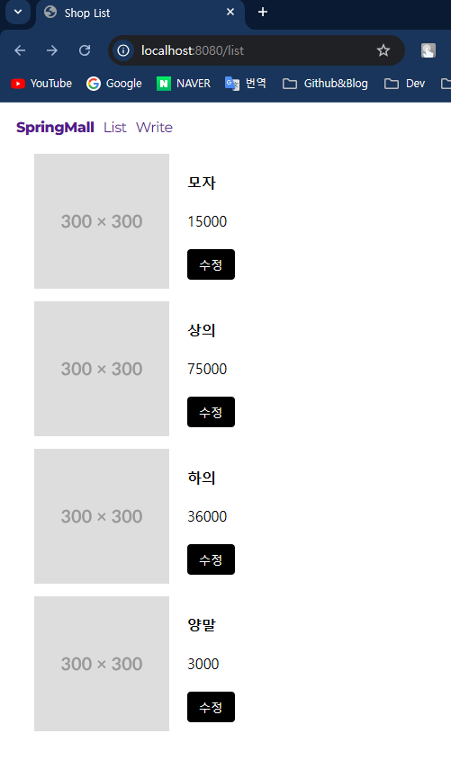
- 버튼 클릭 시 수정 로직이 발생하는게 아닌 수정폼으로 이동하는 함수를 구현한다.
  ```html
  <script>
    function updateForm(id) {
      window.location.assign(`/update/${id}`);
    }
  </script>
  ```
### 2. 상품 수정페이지 구현 및 로직 구현
- 우선 `/update/{id}` 주소로 매핑이 된 컨트롤러부터 구현한다.
- id값을 통해 상품의 상세 데이터를 가져와서 미리 입력폼에 뿌려준다.
  ```java
  @GetMapping("/update/{id}")
  public String update(@PathVariable String id, Model model) {
      model.addAttribute("item", itemService.findItem(id));
      return "update";
  }
  ```
- 그리고 `update.html` 페이지는 기존 `write.html` 을 재사용하여 조금만 수정한다.
  ```html
  <!doctype html>
  <html lang="ko" xmlns:th="http://www.thymeleaf.org">
  <head>
    <meta charset="UTF-8">
    <meta name="viewport" content="width=device-width, user-scalable=no, initial-scale=1.0, maximum-scale=1.0, minimum-scale=1.0">
    <meta http-equiv="X-UA-Compatible" content="ie=edge">
    <title>Shop update</title>
    <link href="/css/main.css" rel="stylesheet">
  </head>
  <body>
  <div th:replace="~{nav.html::navbar}"></div>
  <form th:action="|/update/${item.getId()}|" method="post">
    <input name="title" th:value="${item.getTitle()}">
    <input name="price" th:value="${item.getPrice()}">
    <button type="submit">수정</button>
  </form>
  
  </body>
  </html>
  ```
  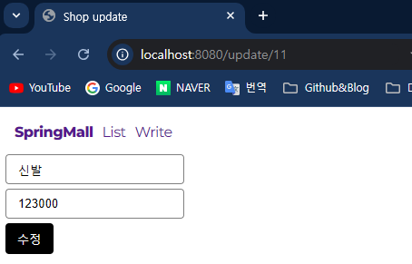
- 보통은 `REST API` 룰에 의하면 수정은 `Fetch` 또는 `Put` 메서드를 사용하는데 `Post` 를 사용한 이유는 **HTML Form 전송방식을 이용**하기 위해서다.
  - `Fetch`/`Put` 을 사용하면 서버가 완전한 `RestController` 가 되야한다. 아니면 `Ajax` 를 통한 통신을 해야한다.
- URL 이 `/update/{id}` 이고 `Post` 방식의 컨트롤러는 다음과 같이 구현한다.
  ```java
  @PostMapping("/update/{id}")
  public String update(@PathVariable String id, @RequestParam String title, @RequestParam Integer price) {
      try {
          itemService.updateItem(id, title, price);
          return "redirect:/detail/" + id;
      } catch (Exception e) {
          System.out.println(e.getMessage());
          return "redirect:/list";
      }
  }
  ```
  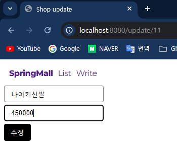
- 실제 비즈니르 로직이 있는 `Service` 레이어를 보면 DB 수정이 일어나기 때문에 `@Transactional` 을 사용한 메서드로 구현하였다.
  - 따로 `Update` 쿼리가 나가지 않은 이유는 **JPA 의 더티체킹** 기능 덕분이다. `@Transactional` 에 의해 메서드 종료시 커밋이 날라가는데 그때 업데이트 쿼리가 나가게 된다.
  ```java
  @Transactional
  public void updateItem(String id, String title, Integer price) {
      Item item = findItem(id);
  
      item.setTitle(title);
      item.setPrice(price);
  }
  ```
- 위 로직들이 문제없이 성공한다면 아래와 같이 수정된 데이터가 반영된 상세페이지로 이동한다.

  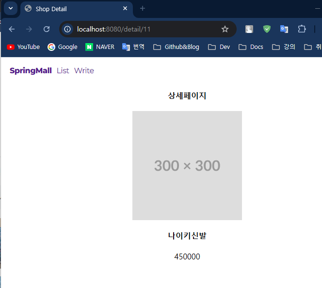
---
## 상품 데이터 삭제하기
> 삭제는 수정보다 더 간단하다. `DELETE` 메서드를 이용하여 상품ID값으로 삭제 쿼리만 날려주면 되기 때문이다.</br>
> 하지만 DELTE 메서드를 사용하기 위해 `jQuery` 기반의 `Ajax` 통신으로 구현한다.

### 1. 삭제 버튼 추가
- 기존의 수정버튼과 마찬가지로 `list.html` 에 삭제 버튼을 추가해준다.
- 상품의 title을 data 라는 별칭을 이용해 빼둔 이유는 핸들러에서 보안상의 이유로 문자열이나 텍스트 데이터를 직접 사용하지 않는 것을 추천하기 때문이다.
- 이런 데이터들은 XSS를 유발할 수 있다.
  ```html
  <!-- 생략 .. -->
  <div th:replace="~{nav.html::navbar}"></div>
  <div class="card" th:each="item: ${items}">
    <a th:href="@{|/detail/${item.getId()}|}">
      
    </a>
      <div>
        <div>
          <h4 th:text="${item.getTitle()}">바지</h4>
          <p th:text="${item.getPrice()}">7억</p>
        </div>
        <button class="btn-update" th:onclick="|updateForm(${item.getId()})|">수정</button>
        <button class="btn-delete" th:data="${item.getTitle()}" th:onclick="|deleteById(${item.getId()}, this)|">삭제</button>
      </div>
  </div>
  <!-- 생략 .. -->
  ```
  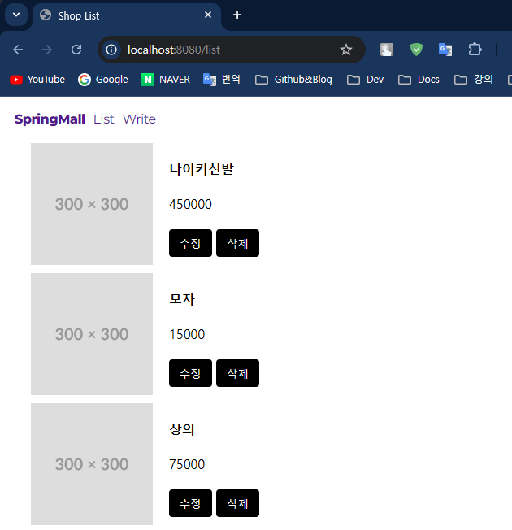
- 그리고 `onclick` 함수로 `deleteById()`를 구현했다.
- 해당 함수는 `confirm()` 함수로 데이터를 삭제 할지 말지 사용자에게 선택을 받은 후 선택에 따라 로직을 구현하면 된다.
- 이 때, `jQuery` 를 사용하기 위해 `<head>` 태그에 코드를 추가했다.
  ```html
  <!-- 생략 .. -->
  <head>
    <script src="https://code.jquery.com/jquery-3.7.1.js" integrity="sha256-eKhayi8LEQwp4NKxN+CfCh+3qOVUtJn3QNZ0TciWLP4="
            crossorigin="anonymous"></script>
  </head>
  <!-- 생략 .. -->
  ```
- Ajax 를 jQuery 기반으로 다음과 같이 작성한다.
  ```html
  <script>
    function deleteById(id) {
      if(confirm("삭제 하시겠습니까?")){
        $.ajax({
          url: `/delete/${id}`,
          type: 'delete',
          dataType: 'text'
        }).done(res => {
          console.log('삭제 성공', res);
          window.location.replace(`/list`);
        }).fail(err => {
          console.log('삭제실패', err);
        });
      }else{
        alert("삭제가 취소되었습니다!");
      }
    }
  </script>
  ```
- `/delete/{id}` 인 컨트롤러와 서비스 레이어는 다음과 같이 구현한다.
  ```java
  @DeleteMapping("/delete/{id}")
  @ResponseBody
  public ResponseEntity<?> delete(@PathVariable String id) {
      try {
          itemService.deleteItem(itemService.findItem(id));
          return ResponseEntity.ok().body("삭제 성공");
      } catch (Exception e) {
          return ResponseEntity.badRequest().body("삭제 실패");
      }
  }
  ```
  ```java
      @Transactional
      public void deleteItem(Item item) {
          itemRepository.delete(item);
      }
  ```
  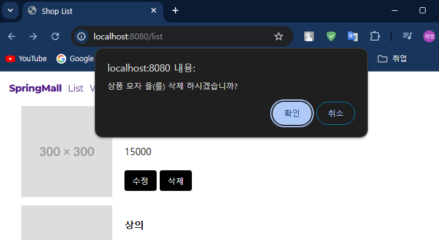
  
  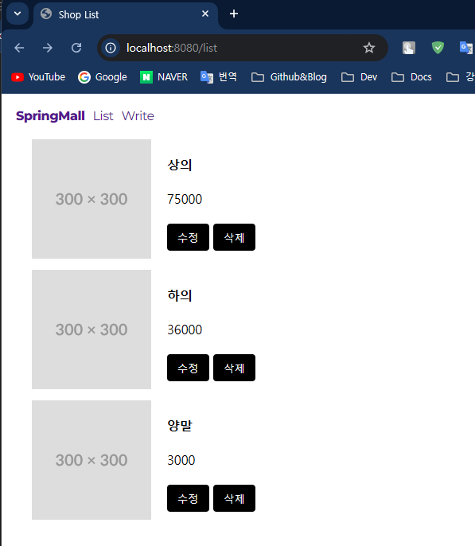
---